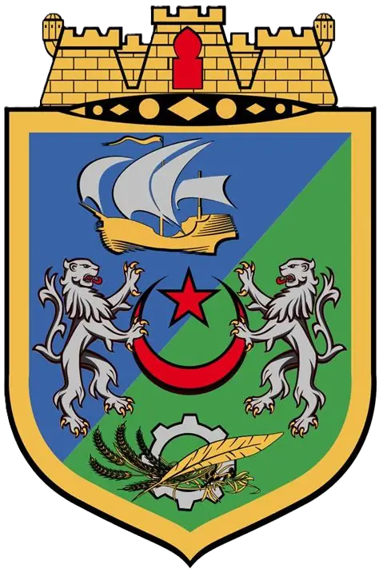

# مولّد تقارير الميدان — Wilaya d'Alger Field Report Generator

<p align="center">
  
</p>

<p align="center">
  <strong>Progressive Web App moderne pour générer, illustrer et partager des rapports de terrain en quelques secondes.</strong>
</p>

<p align="center">
  <a href="https://ademoo077.github.io/">🌐 Live Demo</a>
  ·
  <a href="https://github.com/ademoo077/ademoo077.github.io">📦 Repository</a>
</p>

<p align="center">
  
  
  
  
</p>

---

## 📌 Présentation

**مولّد تقارير الميدان** est une application web légère, rapide et responsive conçue pour les équipes de terrain, les services de contrôle, les agents de voirie et toute structure ayant besoin de produire des rapports visuels immédiatement exploitables.

L'application permet de :

* ajouter ou capturer des photos depuis un appareil mobile ;
* insérer la date, l'heure, la localisation et la description du rapport ;
* récupérer les coordonnées GPS automatiquement ;
* générer une image finale professionnelle via Canvas ;
* exporter le rapport en **JPEG** ou **PNG** ;
* partager rapidement le contenu via **WhatsApp** ;
* utiliser l'application comme une **PWA installable**.

---

## ✨ Fonctionnalités principales

### 🖼️ Gestion des photos

* Ajout de photos depuis l'appareil.
* Capture directe via caméra mobile.
* Support jusqu'à **4 photos**.
* Génération automatique d'une grille visuelle propre selon le nombre d'images.

### 📍 Localisation & GPS

* Récupération automatique des coordonnées GPS.
* Affichage de la latitude et de la longitude.
* Génération automatique d'un lien Google Maps.
* Carte interactive basée sur OpenStreetMap via Leaflet.

### 📝 Informations du rapport

* Date et heure modifiables.
* Localisation textuelle.
* Description du problème ou de l'observation.
* Champ de titre pour afficher un bandeau rouge sur l'image générée.
* Boutons de copie rapide pour la localisation, le GPS et le texte du rapport.

### 🎨 Génération visuelle

* Rendu final via **HTML Canvas**.
* Bandeau inférieur rouge pour les informations du rapport.
* Bandeau supérieur rouge optionnel pour le titre de l'événement.
* Date incrustée directement sur l'image.
* Prévisualisation en temps réel.

### 📤 Export & partage

* Export en **JPEG** avec contrôle de qualité.
* Export en **PNG**.
* Téléchargement instantané.
* Partage du message de rapport via WhatsApp.

### 📱 Progressive Web App

* Application installable sur mobile.
* Manifest configuré.
* Icône d'application.
* Expérience mobile optimisée.
* Interface sombre/claire.

---

## 🧱 Stack technique

| Technologie            | Rôle                             |
| ---------------------- | -------------------------------- |
| **HTML5**              | Structure de l'application       |
| **Tailwind CSS**       | Design responsive et moderne     |
| **JavaScript Vanilla** | Logique applicative              |
| **Canvas API**         | Génération de l'image finale     |
| **Geolocation API**    | Récupération des coordonnées GPS |
| **Leaflet.js**         | Carte interactive                |
| **OpenStreetMap**      | Fond de carte                    |
| **PWA Manifest**       | Installation mobile              |
| **GitHub Pages**       | Hébergement statique             |

---

## 🚀 Démo en ligne

L'application est disponible ici :

👉 **https://ademoo077.github.io/**

---

## 📂 Structure du projet

```text
.
├── index.html        # Application principale
├── manifest.json     # Configuration PWA
├── logo.png          # Icône et logo de l'application
└── README.md         # Documentation du projet
```

---

## ⚙️ Utilisation locale

Aucune installation complexe n'est nécessaire.

### 1. Cloner le projet

```bash
git clone https://github.com/ademoo077/ademoo077.github.io.git
cd ademoo077.github.io
```

### 2. Lancer localement

Ouvrir simplement `index.html` dans un navigateur moderne.

Pour une meilleure compatibilité PWA/GPS, utiliser un petit serveur local :

```bash
python -m http.server 8000
```

Puis ouvrir :

```text
http://localhost:8000
```

---

## 🔐 Confidentialité

L'application est conçue pour rester simple et respectueuse des données :

* aucune base de données ;
* aucun backend ;
* aucune authentification ;
* les images sont traitées localement dans le navigateur ;
* les coordonnées GPS ne sont utilisées que pour générer le rapport et le lien Google Maps.

---

## 📱 Installation sur mobile

Sur smartphone :

1. Ouvrir l'application dans le navigateur.
2. Appuyer sur le menu du navigateur.
3. Choisir **Ajouter à l'écran d'accueil**.
4. L'application s'ouvrira comme une app mobile classique.

> Pour que la géolocalisation fonctionne correctement, le site doit être ouvert en HTTPS ou via localhost.

---

## 🧭 Cas d'usage

Cette application peut être utilisée pour :

* rapports de terrain ;
* contrôle de voirie ;
* suivi des anomalies urbaines ;
* signalement avec preuve photo ;
* documentation d'interventions ;
* partage rapide entre équipes opérationnelles.

---

## 🛣️ Améliorations possibles

* Ajout d'un historique local des rapports.
* Export PDF.
* Compression intelligente des images.
* Support multilingue complet.
* Signature ou cachet officiel sur le rapport.
* Mode hors ligne avancé.
* Synchronisation avec un tableau de bord administratif.

---

## 👤 Auteur

Développé et maintenu par **ademoo077**.

* GitHub: [@ademoo077](https://github.com/ademoo077)
* Live App: [ademoo077.github.io](https://ademoo077.github.io/)

---

## 🏁 Objectif du projet

Fournir un outil simple, rapide et fiable pour transformer une observation de terrain en rapport visuel professionnel, prêt à être téléchargé, partagé et archivé.
